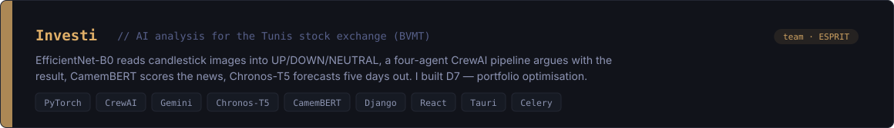
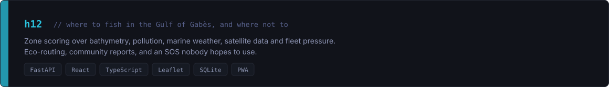
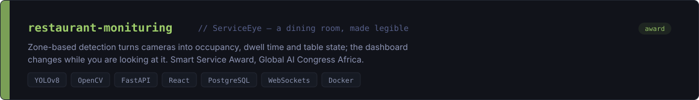
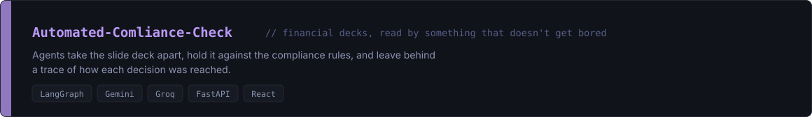
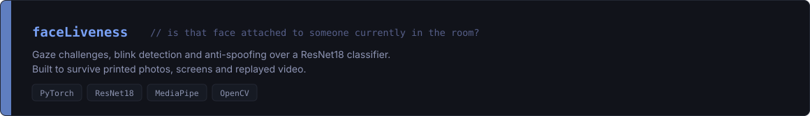
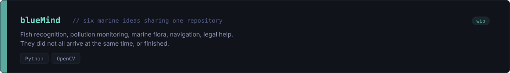
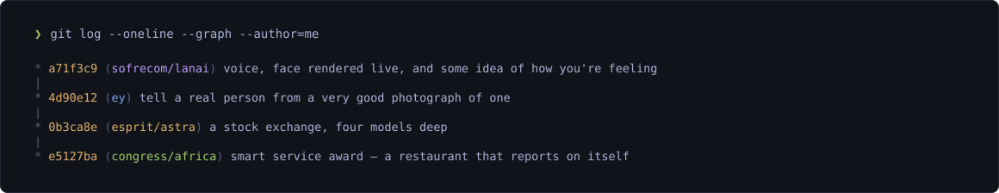

### `~/stack`

<p>


</p>

<p>


</p>

### `~/projects`

<a href="https://github.com/Ghassenboussalem/Investi"></a>

<a href="https://github.com/Lehnin2/h12"></a>

<a href="https://github.com/Lehnin2/restaurant-monituring"></a>

<a href="https://github.com/Lehnin2/Automated-Comliance-Check"></a>

<a href="https://github.com/Lehnin2/faceLiveness"></a>

<a href="https://github.com/Lehnin2/blueMind"></a>

<details>
<summary><code>~/archive</code></summary>

<br>

```console
❯ ls -1 ~/archive
hankachou
java
liiik
trial
Projet
# kept for reference. scaffolding from earlier passes.
```

</details>

### `~/elsewhere`



### `~/stats`

<div align="center">


</div>

<br>

```console
❯ uptime
still running
```
