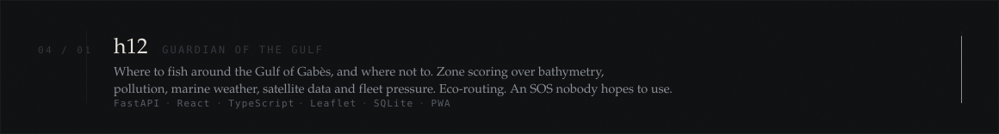
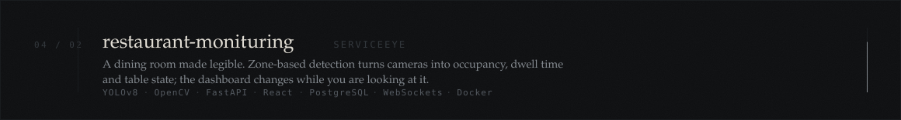
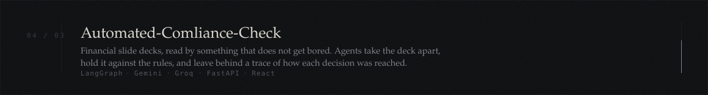
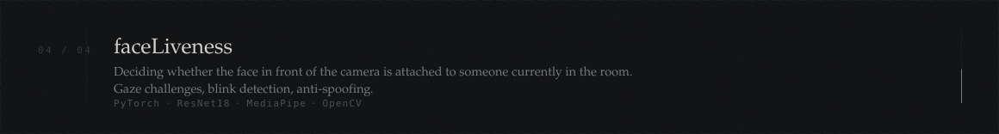
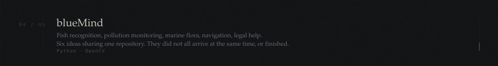

<br>

### 01 · current

MSc Computer Science — Data Science, EURECOM.

Mostly computer vision and data, plus the unglamorous plumbing either one needs before it does anything useful. I tend to learn a thing by building it, then building it again with fewer parts.


### 02 · recurring

```text
cameras pointed at things that move
models that have to survive contact with an actual user
systems that are three systems pretending to be one
documents nobody wants to read
the sea, for reasons I haven't examined
```


### 04 · built

<a href="https://github.com/Lehnin2/h12"></a>

<a href="https://github.com/Lehnin2/restaurant-monituring"></a>

<a href="https://github.com/Lehnin2/Automated-Comliance-Check"></a>

<a href="https://github.com/Lehnin2/faceLiveness"></a>

<a href="https://github.com/Lehnin2/blueMind"></a>

<details>
<summary><sub>older entries</sub></summary>

<br>

```text
hankachou · java · liiik · trial · Projet
kept for reference. scaffolding from earlier passes.
```

</details>


### 05 · elsewhere

An identity verification system that had to tell a real person from a very good photograph of one. <sub>— EY</sub>

An assistant with a voice, a face rendered in real time, and some idea of how you're feeling while you talk to it. <sub>— Sofrecom / LanAI</sub>

A restaurant that reports on itself. Smart Service Award, Global AI Congress Africa. <sub>— ServiceEye</sub>


### 06 · trace

<div align="center">


</div>


<div align="center">
<sub>updated irregularly · rebuilt more often</sub>
</div>
